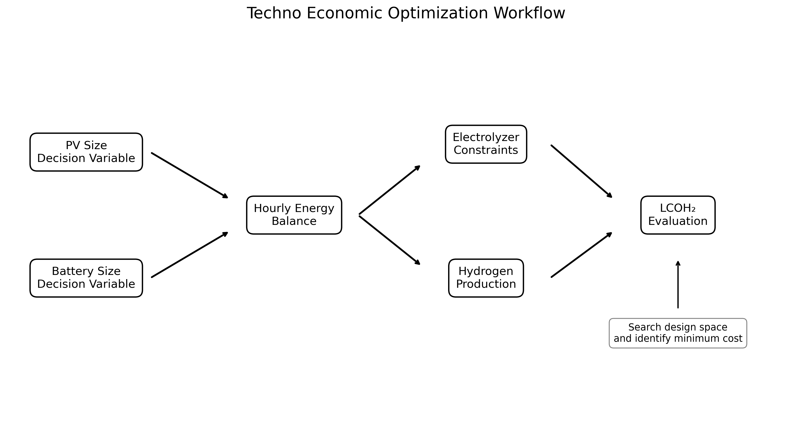
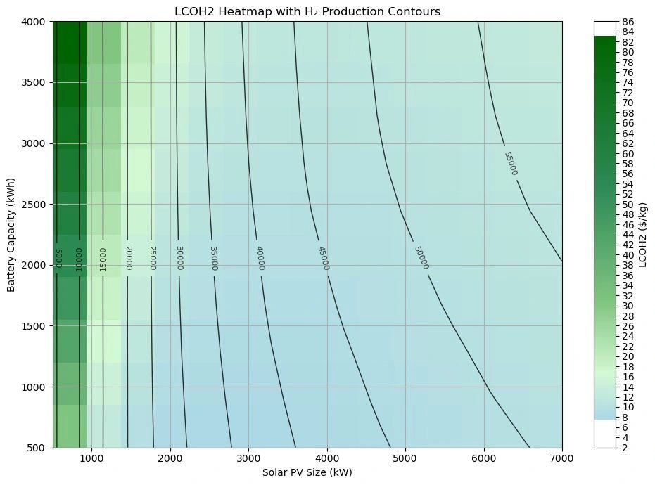
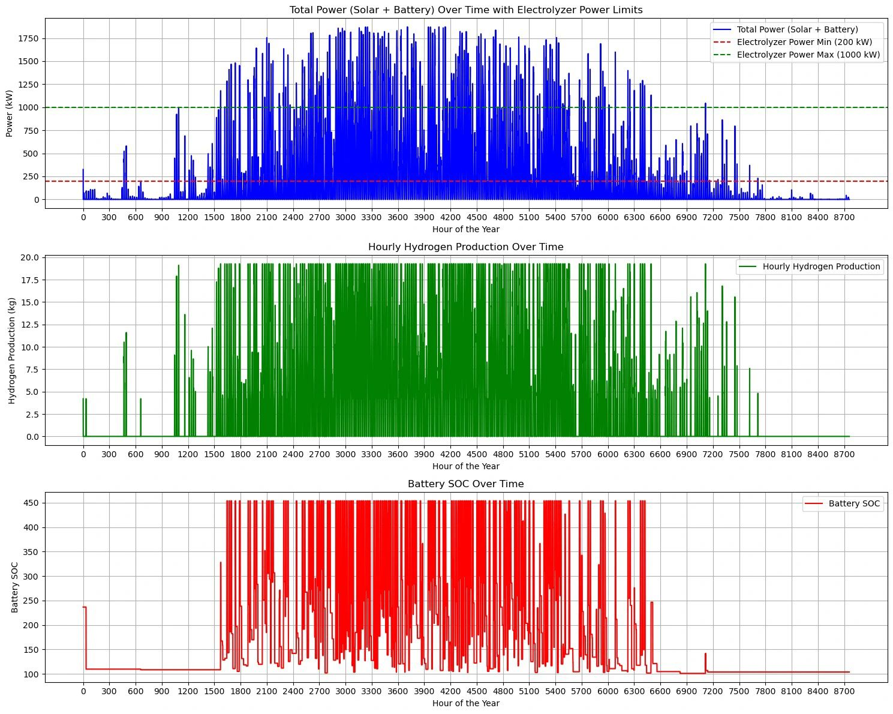
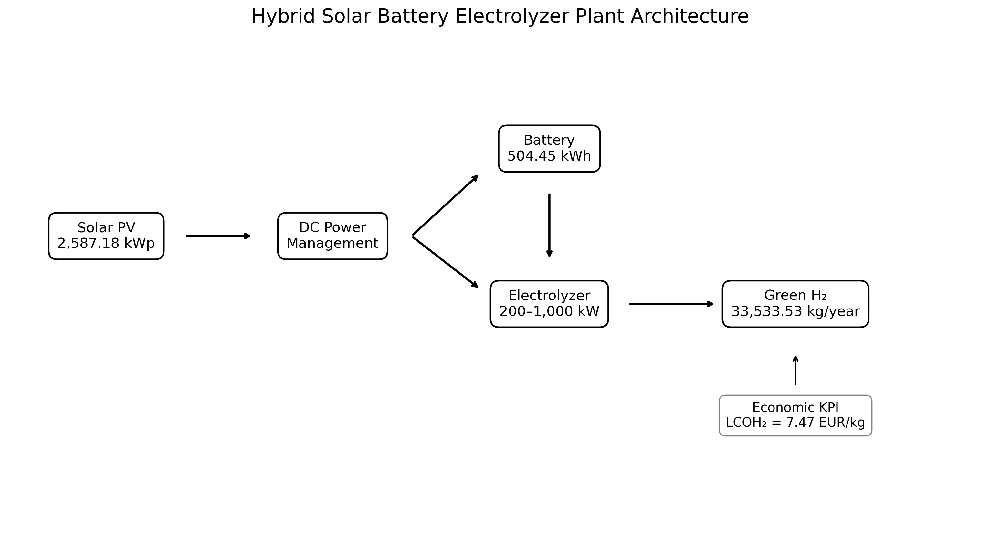
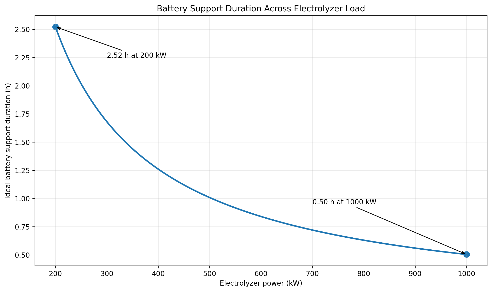
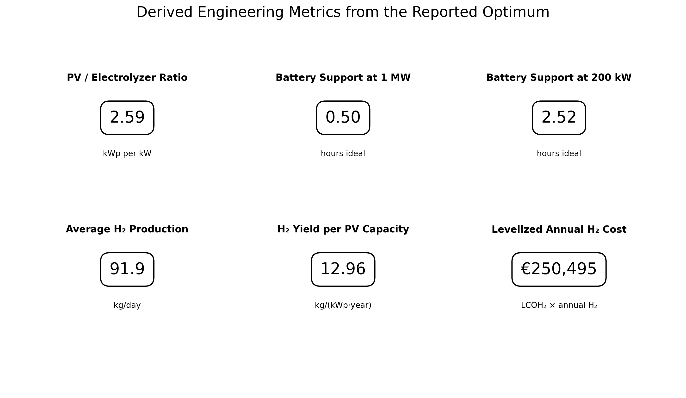

# Green Hydrogen Production Plant Optimization

### Python based techno-economic optimization and hourly performance analysis of a hybrid solar PV battery electrolyzer system

<p align="center">
<strong>Green Hydrogen • Solar PV • Battery Storage • Electrolyzer • LCOH₂ • Python • Optimization • Time Series Analysis • Energy Systems Engineering</strong>
</p>

---

## Executive Summary

This project presents a complete engineering analysis of a **renewable hydrogen production plant** integrating **solar photovoltaic generation, battery energy storage and a grid independent electrolyzer operating strategy**.

The engineering problem is not simply to maximize PV capacity or battery size. The objective is to identify a combination of generation and storage that supplies the electrolyzer effectively while minimizing the **Levelized Cost of Hydrogen, LCOH₂**.

The reported optimum is:

| Design or performance indicator | Result |
| --- | ---: |
| Solar PV capacity | **2,587.18 kWp** |
| Battery storage capacity | **504.45 kWh** |
| Electrolyzer operating range | **200 to 1,000 kW** |
| Annual hydrogen production | **33,533.53 kg/year** |
| Minimum LCOH₂ | **7.47 EUR/kg** |

The study combines **design space optimization**, **hourly simulation**, **battery state analysis**, **electrolyzer operating constraints**, **hydrogen production modelling** and **techno-economic evaluation**.

---

# 1. Engineering Problem

Variable solar generation does not naturally match the operating requirements of an electrolyzer.

The system therefore has four coupled engineering decisions:

1. How much PV capacity should be installed?
2. How much battery storage is economically justified?
3. How should the electrolyzer operate between its minimum and maximum power limits?
4. Which PV and battery combination minimizes hydrogen production cost?

The optimization therefore evaluates **technical feasibility and economics simultaneously**.

---

# 2. Optimization Methodology



The workflow evaluates candidate PV and battery capacities using an hourly energy balance.

For each candidate design:

```text
PV generation
      |
      v
Hourly power balance
      |
      +----------------------+
      |                      |
      v                      v
Electrolyzer load       Battery operation
      |                      |
      +----------+-----------+
                 |
                 v
        Hourly H₂ production
                 |
                 v
       Annual H₂ production
                 |
                 v
           LCOH₂ calculation
                 |
                 v
      Select minimum cost design
```

The reported design variables are **PV peak power** and **battery energy capacity**.

---

# 3. Original Optimization Result



This is the core techno economic result of the project.

The heatmap shows how **LCOH₂ changes across PV capacity and battery capacity**, while the contour lines show hydrogen production.

This representation is valuable because it allows three engineering questions to be evaluated at the same time:

- How does plant size affect hydrogen cost?
- How does plant size affect hydrogen output?
- Where does additional PV or battery capacity stop providing sufficient economic benefit?

The reported optimum is approximately:

**PV = 2,587.18 kWp**

**Battery = 504.45 kWh**

**LCOH₂ = 7.47 EUR/kg**

**Annual H₂ = 33,533.53 kg/year**

---

# 4. Hourly Plant Operation



The second original result demonstrates the dynamic operation of the optimized system over a full year.

It includes:

### Total available power

Solar generation and battery contribution determine the instantaneous electrical power available to the electrolyzer.

### Electrolyzer constraints

The model applies a minimum operating power of **200 kW** and maximum power of **1000 kW**.

When available power is below the minimum threshold, the electrolyzer cannot operate normally.

When available power exceeds the rated maximum, the electrolyzer power is capped.

### Hourly hydrogen production

Hydrogen output follows the feasible electrolyzer power profile and therefore varies strongly with renewable resource availability.

### Battery state

The battery absorbs excess renewable electricity and discharges when useful for supporting plant operation.

This time series result demonstrates the interaction between **resource variability, storage dynamics, electrolyzer constraints and hydrogen production**.

---

# 5. Plant Architecture



The system consists of:

**Solar PV**

Primary renewable power source.

**Battery energy storage**

Buffers renewable variability and supports electrolyzer operation.

**Electrolyzer**

Converts renewable electricity into hydrogen within a defined operating window.

**Economic model**

Evaluates the cost effectiveness of the resulting hydrogen production.

---

# 6. Engineering Calculations

The reported optimum enables several additional engineering metrics to be calculated without introducing new assumptions.

## PV to electrolyzer sizing ratio

```text
PV / electrolyzer ratio
= 2,587.18 kWp / 1,000 kW
= 2.587 kWp/kW
```

This indicates that the PV plant is substantially oversized relative to the electrolyzer nameplate rating, which is consistent with a design intended to improve renewable availability across variable solar conditions.

## Battery support duration

At **1,000 kW electrolyzer load**:

```text
504.45 kWh / 1,000 kW
= 0.504 h
```

At **200 kW electrolyzer load**:

```text
504.45 kWh / 200 kW
= 2.522 h
```

These are ideal energy only durations before accounting for battery efficiency, reserve SOC and conversion losses.



The curve shows why the battery should be interpreted primarily as **short duration flexibility**, not as long duration seasonal storage.

## Average hydrogen production

```text
Annual H₂ = 33,533.53 kg/year

Average = 91.87 kg/day

Average = 2794.46 kg/month

Year average = 3.828 kg/h
```

These values are annualized averages rather than instantaneous electrolyzer output.

## Hydrogen yield relative to installed PV

```text
33,533.53 kg/year / 2,587.18 kWp
= 12.96 kg H₂/(kWp·year)
```

## Levelized annual hydrogen cost equivalent

```text
7.47 EUR/kg × 33,533.53 kg/year
= EUR 250,495.47/year
```

This is the annual hydrogen quantity valued at the reported levelized production cost. It is **not** the same as annual cash OPEX.



Full calculations are documented in [`docs/engineering_calculations.md`](docs/engineering_calculations.md).

---

# 7. Mathematical Model

## Hourly energy balance

A general hourly balance for the system is:

```text
P_available(t)
=
P_PV(t)
+ P_battery,discharge(t)
− P_battery,charge(t)
```

## Electrolyzer operating logic

Conceptually:

```text
P_el(t) = 0
if P_available(t) < P_min
```

otherwise

```text
P_el(t) = min[P_available(t), P_max]
```

with:

```text
P_min = 200 kW
P_max = 1000 kW
```

## Hydrogen production

Hydrogen production can be represented as:

```text
m_H2(t) = P_el(t) × Δt / SEC_H2
```

where `SEC_H2` is the electrolyzer specific electricity consumption in kWh/kg.

A specific SEC value was not supplied in the available project material, so this repository does not invent one.

## Battery state equation

A general battery balance can be written as:

```text
E_batt(t+1)
=
E_batt(t)
+ η_charge P_charge(t) Δt
− P_discharge(t) Δt / η_discharge
```

Battery efficiencies and operational SOC limits were not supplied, so no unsupported numerical values are inserted.

## Economic objective

The optimization target is:

```text
minimize LCOH₂(PV capacity, battery capacity)
```

subject to:

```text
hourly energy balance
electrolyzer minimum power
electrolyzer maximum power
battery energy balance
annual hydrogen production
```

---

# 8. Additional Engineering Outcomes

The reported optimum supports several conclusions.

### PV oversizing is an important design feature

The PV to electrolyzer ratio is approximately **2.59 kWp per kW**. This suggests the design relies on generation oversizing to increase the hours in which sufficient renewable power is available for electrolysis.

### The battery is primarily a short duration flexibility asset

At full electrolyzer power, the reported battery capacity corresponds to only about **0.50 hours** of ideal support.

Even at the minimum electrolyzer operating power, the ideal support duration is about **2.52 hours**.

This indicates that the battery is better interpreted as a **short term balancing component** than a long duration energy source.

### The plant produces about 91.9 kg of hydrogen per day on an annual average basis

The yearly output corresponds to approximately **91.9 kg/day**, although actual hourly production is highly variable as shown in the original time series.

### The optimization is a coupled system problem

The heatmap demonstrates that increasing PV or battery size alone does not guarantee the lowest hydrogen cost.

The optimum occurs where the marginal benefit from additional renewable energy and storage no longer compensates for the added system cost.

### Operational constraints materially affect economics

The 200 kW minimum electrolyzer power means that small amounts of renewable electricity cannot always be converted directly into hydrogen. Storage therefore has value not only for energy shifting but also for helping the plant remain within a feasible operating region.

---

# 9. Repository Structure

```text
green hydrogen engineering optimization

data
    reported_project_results.csv
    derived_engineering_metrics.csv
    battery_support_curve.csv

figures
    01_lcoh2_optimization_heatmap.jpg
    02_hourly_operation_results.jpg
    03_optimization_workflow.png
    04_system_architecture.png
    05_battery_support_duration.png
    06_derived_engineering_metrics.png

src
    engineering_calculations.py
    create_engineering_figures.py

docs
    engineering_calculations.md

README.md
requirements.txt
```

---

# 10. Run the Python Analysis

Install the dependencies:

```bash
pip install -r requirements.txt
```

Run the engineering calculations:

```bash
python src/engineering_calculations.py
```

Generate the derived figures:

```bash
python src/create_engineering_figures.py
```

---

# 11. Engineering Skills Demonstrated

| Engineering area | Project evidence |
| --- | --- |
| Green hydrogen | Electrolyzer based renewable H₂ production |
| Solar PV engineering | PV capacity optimization |
| Battery storage | Hourly SOC and energy balancing |
| Electrolyzer modelling | Minimum and maximum load constraints |
| Techno-economic analysis | LCOH₂ optimization |
| System optimization | Two dimensional PV battery design search |
| Time series simulation | Full year hourly plant operation |
| Python | Calculations, post processing and visualization |
| Excel | Supporting calculations and data evaluation |
| Energy systems integration | Coupled generation storage conversion model |
| Engineering communication | Heatmaps, contours, operational plots and derived metrics |

---

# 12. Model Scope and Limitations

The two original project figures are preserved because they contain the strongest evidence of the original engineering simulation.

The available source material does **not** contain the complete raw hourly dataset, component CAPEX breakdown, battery round trip efficiency, electrolyzer specific electricity consumption, project lifetime, discount rate or replacement assumptions.

Those values are therefore **not fabricated**.

The additional calculations in this repository are derived only from the reported optimum and clearly identified equations.

This keeps the portfolio technically credible while still demonstrating the engineering implications of the results.

---

# Author

## Nadeem Raza

Chemical Engineer  
M.Sc. Clean Energy Processes

Interests include green hydrogen, renewable energy integration, energy system optimization, techno economic analysis and electrochemical systems.

[LinkedIn](https://www.linkedin.com/in/nadeem-raza-255902208/)
